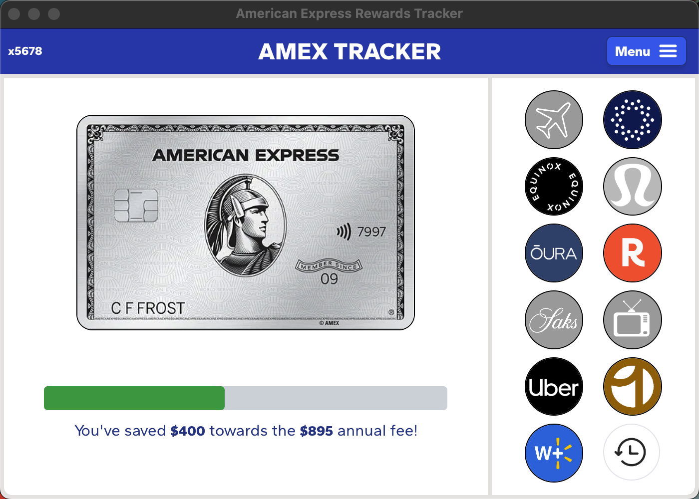
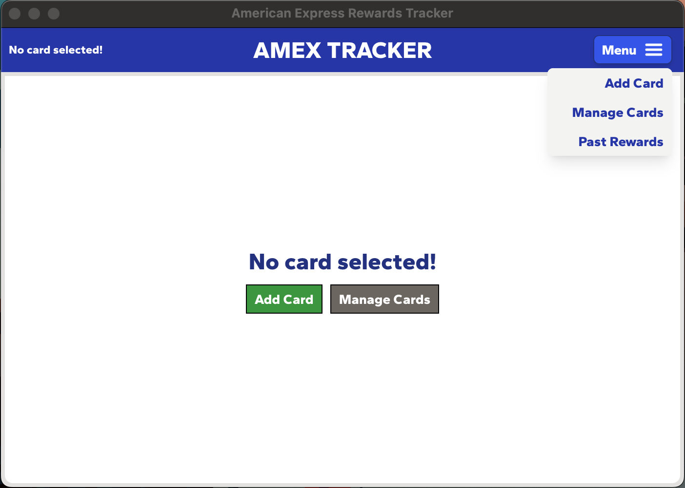
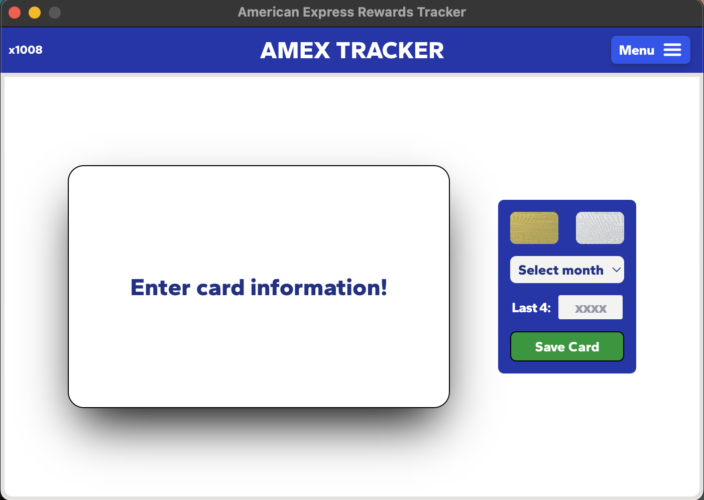
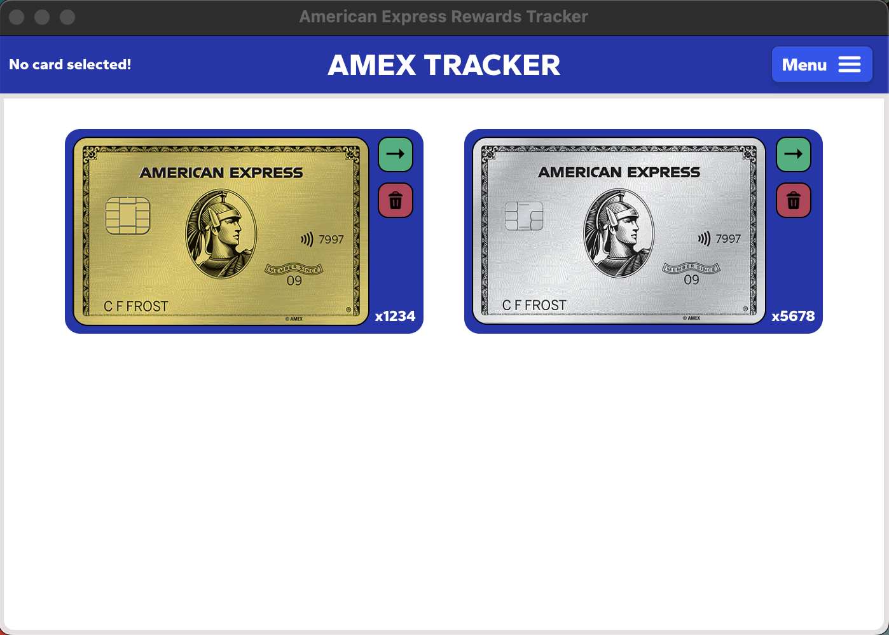

<!-- markdownlint-disable MD033 -->

<div style="text-align: justify">

# Amex Tracker

Amex Tracker is a lightweight desktop application designed to help American Express Gold and Platinum cardholders efficiently track their primary reward usage. By tracking the savings accumulated through AMEX partner rewards, users can ensure they make the most of the pricey annual memberships. The app provides a simple and intuitive interface, making it easy to monitor spending, rewards, and overall card value at a glance.

---

## Features

- Track AMEX partner reward usage and their availability
- Manage rewards for multiple AMEX cards in one place
- View accumulated savings from rewards (both since renewal and lifetime)
- Simple, intuitive interface

---

## Installation

The most recent version of Amex Tracker can be installed from the releases section of the GitHub repository. Amex Tracker was developed on and optimized for Apple Silicon, but supports Windows x86 machines as well.

- For _Apple Silicon_: download `AmexTracker.dmg`
- For _Windows x86_: download `AmexTracker.exe`

Download the latest versions from the **Releases** page of this repository.

> **Note:** AmexTracker builds are *not* signed or notarized. Extra steps may be required to run uncertified apps on your device. Install at your own risk.

### Windows

1. Download the `AmexTracker-Setup.exe` from Releases.
2. Run the installer.
3. If Windows shows **Windows protected your PC**, click:
   **More Info → Run anyway**
   (This is normal for unsigned apps.)
4. Complete the installation.

### MacOS

1. Download the `.dmg` from Releases and open it.
2. Drag **AmexTracker.app** into your **Applications** folder.
3. Try opening the app — macOS may show:
   **“AmexTracker cannot be opened because the developer cannot be verified.”**

#### Option 1: Allow Through System Settings

1. Open **System Settings → Privacy & Security**.
2. Scroll down to find **“AmexTracker was blocked from opening.”**
3. Click **Allow Anyway**.
4. Open the app again and select **Open**.

After this, the app will open normally every time.

#### Option 2: Use the Terminal

1. Make sure **AmexTracker.app** is in /Applications
2. Open **Terminal** and run:

```bash
sudo xattr -r -d com.apple.quarantine /Applications/AmexTracker.app
```

**What this command does (for user confidence):**

- `sudo` — runs the command with permission to modify system-protected folders like `/Applications`.  
- `xattr` — a macOS tool that manages extended attributes (extra metadata on files).  
- `-r` — applies the change to the app and all files inside it.  
- `-d com.apple.quarantine` — deletes macOS’s “quarantine” flag, which is added to downloaded apps so Gatekeeper can warn you.  
- `/Applications/AmexTracker.app` — the app that the quarantine flag is being removed from.

**This does NOT disable Gatekeeper system-wide.**  
It only removes the quarantine flag from _this one app_, allowing it to open normally.

---

### Card Dashboard

The main dashboard of Amex Tracker displays key information about the currently selected card. A progress bar shows how much of the annual fee has been offset through rewards which updates in real time. Along with a section where users can mark rewards as used as well as view available ones.

<div style="display: flex; flex-direction: column; align-items: center;justify-content: center;">
    
    <div style="width: 60%;">
        <ul>
            <li>Reward logos in color are available for use.</li>
            <li>Greyed out reward logos are currently unavailable.</li>
            <li>Access the reward history page using the history button.</li>
        </ul>
    </div>
</div>

### Page Navigation

Navigation for Amex Tracker is very simple. Links to all pages can be found when pressing the 'Menu' button in the header from anywhere in the application.

<div style="display: flex; flex-direction: column; align-items: center;justify-content: center;">
    
    <div style="width: 60%;">
        <ul>
            <li><span style="font-weight: bold;">Add Card:</span> Link to new card form, users can add new card information.</li>
            <li><span style="font-weight: bold;">Manage Cards:</span> Card management page, where users can view saved cards.</li>
            <li><span style="font-weight: bold;">Past Rewards:</span> Allows users to make changes to past reward usage.</li>
        </ul>
    </div>
</div>

### Adding a Card

Form where users can add multiple cards to Amex Tracker, allowing them to keep reward accounts for different American Express cards separate and track rewards specific to each card.

<div style="display: flex; flex-direction: column; align-items: center;justify-content: center;">
    
    <div><span style="font-weight: bold; font-size: large">Card Attributes</div>
    <div style="width: 60%;">
        <ul>
            <li><span style="font-weight: bold;">Card Type:</span> Gold or Platinum</li>
            <li><span style="font-weight: bold;">Renewal Month:</span> Month annual fee is paid</li>
            <li><span style="font-weight: bold;">Last 4:</span> Last 4 digits of card number (for identification)</li>
        </ul>
    </div>
</div>

### Card Management

Allows users to change the currently selected card at any time and remove outdated reward records.

<div style="display: flex; flex-direction: column; align-items: center;justify-content: center;">
    
    <div style="width: 60%;">
        <ul>
            <li><span style="font-weight: bold;">Green Arrow:</span> Sets the card as the currently selected card.</li>
            <li><span style="font-weight: bold;">Red Trash Can:</span> Deletes the card and all associated reward history (this action cannot be undone).</li>
        </ul>
    </div>
</div>

### Reward History

Provides users with the ability to go back in time and adjust reward usage history. It also displays the cumulative lifetime savings amount. History allows users to go back to 2020.

<div style="display: flex; flex-direction: column; align-items: center;justify-content: center;">
    
    <div style="width: 60%;">
        <ul>
            <li><span style="font-weight: bold;">Colored Logos:</span> Rewards that are available for use in the currently selected month.</li>
            <li><span style="font-weight: bold;">Green Shading:</span> Indicates rewards that have been used in the currently selected month.</li>
            <li><span style="font-weight: bold;">Red Shading:</span> Indicates rewards that are unavailable in the selected month, typically because they were already redeemed within their reset period.</li>
        </ul>
    </div>
</div>

---

<h6>Disclaimer</h6>

> <small> Amex Tracker is an independent project and is **not affiliated with or endorsed by American Express**. All trademarks and logos are property of their respective owners. Use at your own discretion. </small>

</div>

<!-- markdownlint-enable MD033 -->
